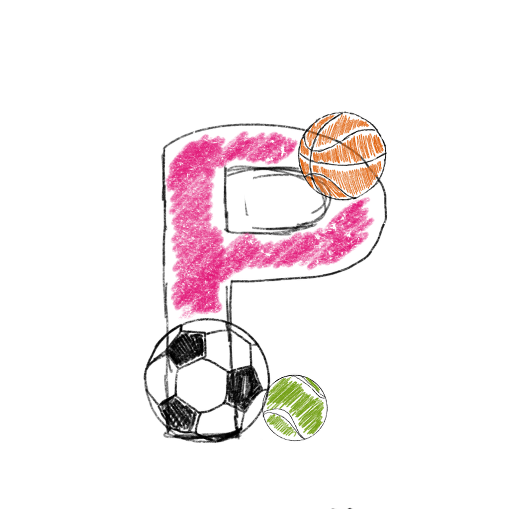

<h1 align="center"> Sports App </h1>  

  

  Built with React Native.

  

  

<!-- START doctoc generated TOC please keep comment here to allow auto update -->
<!-- DON'T EDIT THIS SECTION, INSTEAD RE-RUN doctoc TO UPDATE -->
## Table of Contents

- [Introduction](#introduction)
- [Features](#features)
- [Feedback](#feedback)
- [Contributors](#contributors)
- [Build Process](#build-process)
- [Backers](#backers-)
- [Sponsors](#sponsors-)
- [Acknowledgments](#acknowledgments)

<!-- END doctoc generated TOC please keep comment here to allow auto update -->

## Introduction

View repository and user information, control your notifications and even manage your issues and pull requests. Built with React Native, GitPoint is one of the most feature-rich unofficial GitHub clients that is 100% free.

**Available for both iOS and Android.**

  

## Features

A few of the things you can do with SportApp

* Match with people and play some sports with!
* Chat and setup games

  

  

## Feedback

Feel free to send us feedback on [Twitter](https://twitter.com/gitpointapp) or [file an issue](https://github.com/gitpoint/git-point/issues/new). Feature requests are always welcome. If you wish to contribute, please take a quick look at the [guidelines](./CONTRIBUTING.md)!

If there's anything you'd like to chat about, please feel free to join our [Gitter chat](https://gitter.im/git-point)!

## Contributors

This project follows the [all-contributors](https://github.com/kentcdodds/all-contributors) specification and is brought to you by these [awesome contributors](./CONTRIBUTORS.md).

## Build Process (Front End)

- Clone or download the repo
- `yarn` to install dependencies
- `yarn run link` to link react-native dependencies
- `make sure aws credentials are correct` to link react-native dependencies
- `yarn run ios` to start the packager and run the app in the iOS simulator (`yarn start:ios:logger` will boot the application with [redux-logger](<https://github.com/evgenyrodionov/redux-logger>))
- `yarn run android` to start the packager and run the app in the the Android device/emulator (`yarn start:android:logger` will boot the application with [redux-logger](https://github.com/evgenyrodionov/redux-logger))

Please take a look at the [contributing guidelines](./CONTRIBUTING.md) for a detailed process on how to build your application as well as troubleshooting information.

**Development Keys**: The `CLIENT_ID` and `CLIENT_SECRET` in `api/index.js` are for development purposes and do not represent the actual application keys. Feel free to use them or use a new set of keys by creating an [OAuth application](https://github.com/settings/applications/new) of your own. Set the "Authorization callback URL" to `gitpoint://welcome`.

## Build Process (Back End on AWS)

- `yarn` to install dependencies
- `yarn sls deploy --stage < stage name>` deploy backend to lambda functions check serverless.yml stgaes are shown in ap gateway
- `make sure aws credentials are correct` to link react-native dependencies
- `yarn run ` to start the packager and run the app in the iOS simulator (`yarn start:ios:logger` will boot the application with [redux-logger](<https://github.com/evgenyrodionov/redux-logger>))

## Build Process (Back End local)

- `yarn` to install dependencies
- `yarn run tsc` compile in typescript
- `yarn run dev` run locally

## Debug Process with Detox

- `yarn` to install dependencies
- `yarn run tsc` compile in typescript
- `yarn run dev` run locally

## Load Test with OpenJ

- `yarn` to install dependencies
- `yarn run tsc` compile in typescript
- `yarn run dev` run locally

##  FAQ of problems faced

##
**Q:** Error with currput images when sending multiple images on signup.

**A:** Ans: check if multipart/form-data is set in binary media types -> needs to be set
##

##
**Q:** Error with fliper network!!! Very comman problem
**A:** Ans:if you face flipper can;t connect to network the solution si sfound here on this github change android sdk locatioin!
https://github.com/facebook/flipper/issues/3027#issuecomment-1265146675
##

<table>
  <tr>
    <td align="center"><a href="https://github.com/daminiR"> <b>Damini Rijhwani </b></a> <a href="https://github.com/daminiR" title="Code">💻</a></td>
  </tr>
</table>

<!--## Acknowledgments-->

